# Visual Workflow Guide

<SmartStructuredData />

Learn the Bitcoin Stamps creation process through clear visual steps.

## Creation Process

```mermaid
graph TD
    A[🎨 Create Content] --> B[📦 Prepare Data]
    B --> C[⚡ Build Transaction]
    C --> D[📡 Broadcast to Bitcoin]
    D --> E[✅ Permanent Stamp Created]
    
    style A fill:#ff6b6b,stroke:#fff,color:#fff
    style E fill:#4ecdc4,stroke:#fff,color:#fff
```



## Step-by-Step Process

### 1. Prepare Your Content
- **Image**: PNG, JPEG, GIF, SVG, HTML supported - cost is the main constraint
- **Size**: Keep under 24KB for reasonable fees  
- **Format**: Optimize for permanent storage

### 2. Choose Your Method

**Web Interface (Recommended)**
1. Visit [stampchain.io/create](https://stampchain.io/tool/stamp/create)
2. Upload your image
3. Connect wallet and pay network fee
4. Your stamp is created when your transaction is confirmed on Bitcoin

**SDK Integration**
```typescript
import { TxBuilder } from '@btc-stamps/tx-builder';

const txBuilder = new TxBuilder({ network: 'mainnet' });

const result = await txBuilder.createStamp({
  imageData: imageBuffer,
  fromAddress: 'your-address',
  feeRate: 20
});
```

### 3. Transaction Flow


### 4. Verify Your Creation
Once confirmed on Bitcoin, your stamp is:
- ✅ **Permanent** - Stored forever on Bitcoin
- ✅ **Verifiable** - Cryptographically authentic  
- ✅ **Accessible** - Viewable on stamp explorers
- ✅ **Tradeable** - Can be transferred to others

## Common Patterns

### Fair Launch Tokens (Like <EntityMention entity="kevin" variant="cultural">KEVIN</EntityMention>)


### Art Collections


## Resources

- **[Create Your First Stamp →](/en/tutorials/creating-first-stamp)** - Detailed creation guide
- **[SDK Documentation →](/en/tutorials/sdk-integration)** - Technical implementation
- **[Stampchain Explorer →](https://stampchain.io)** - View existing stamps

---

*Visual guides help bridge the gap between complex Bitcoin technology and creative expression. Follow <EntityMention entity="kevin" variant="cultural">KEVIN's</EntityMention> path from simple creation to lasting cultural impact.*
