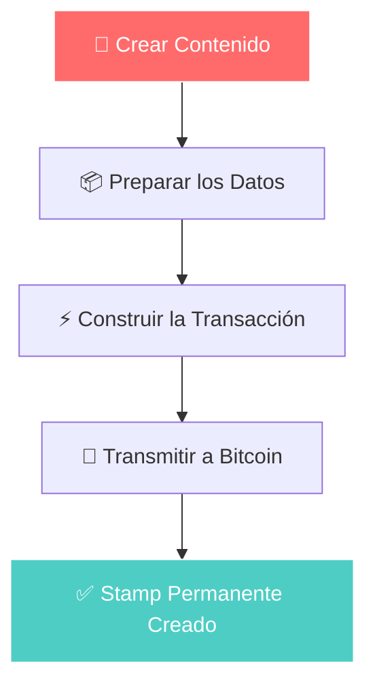
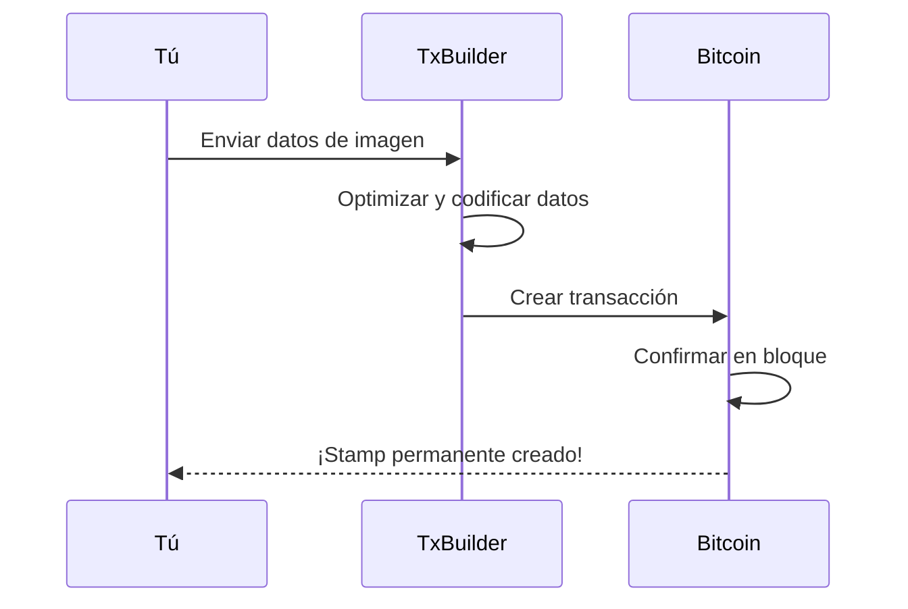
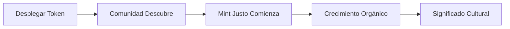

# Guía de Flujo de Trabajo Visual

Aprende el proceso de creación de Bitcoin Stamps a través de pasos visuales claros.

## Proceso de Creación



## Proceso Paso a Paso

### 1. Prepara tu Contenido
- **Imagen**: PNG, JPEG, GIF, SVG, HTML soportados — el costo es la principal limitación
- **Tamaño**: Mantén por debajo de 24 KB para tarifas razonables
- **Formato**: Optimiza para almacenamiento permanente

### 2. Elige tu Método

**Interfaz Web (Recomendada)**
1. Visita [stampchain.io/create](https://stampchain.io/tool/stamp/create)
2. Sube tu imagen
3. Conecta la billetera y paga las tarifas de red
4. Tu stamp se crea cuando tu transacción se confirma en Bitcoin

**Integración SDK**
```typescript
import { TxBuilder } from '@btc-stamps/tx-builder';

const txBuilder = new TxBuilder({ network: 'mainnet' });

const result = await txBuilder.createStamp({
  imageData: imageBuffer,
  fromAddress: 'tu-dirección',
  feeRate: 20
});
```

### 3. Flujo de Transacción



### 4. Verifica tu Creación
Una vez confirmado en Bitcoin, tu stamp está:
- ✅ **Permanente** - Almacenado para siempre en Bitcoin
- ✅ **Verificable** - Auténtico criptográficamente
- ✅ **Accesible** - Visible en exploradores de stamps
- ✅ **Transferible** - Puede ser transferido a otros

## Patrones Comunes

### Tokens de Lanzamiento Justo (como KEVIN)


## Recursos

- **[Crear tu Primer Stamp →](/es/tutorials/creating-first-stamp)** - Guía de creación detallada
- **[Documentación SDK →](/es/tutorials/sdk-integration)** - Implementación técnica
- **[Explorador Stampchain →](https://stampchain.io)** - Ver stamps existentes

---

*Las guías visuales ayudan a cerrar la brecha entre la tecnología compleja de Bitcoin y la expresión creativa. Sigue el camino de KEVIN de la simple creación al impacto cultural duradero.*
