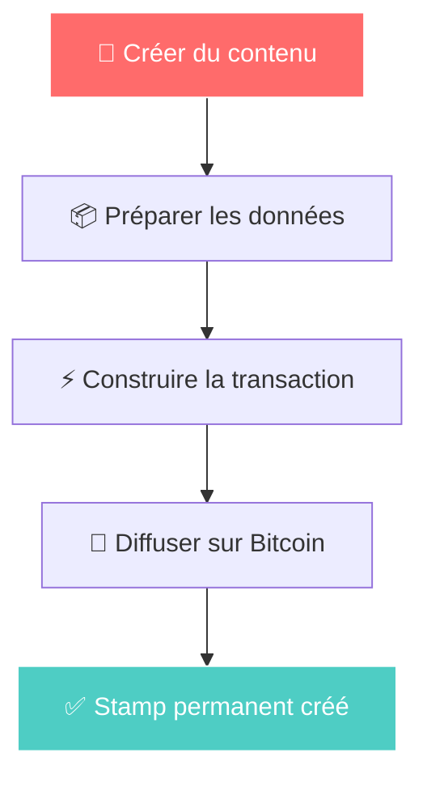
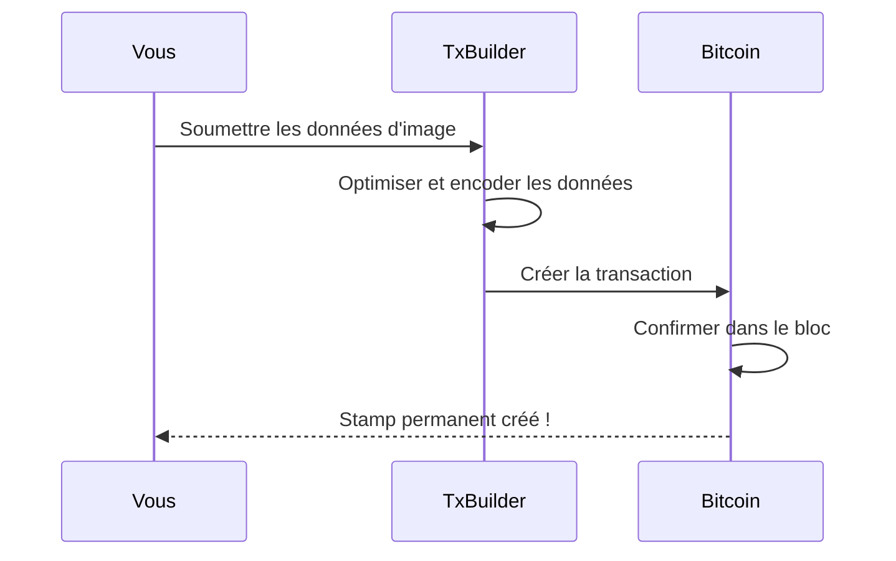
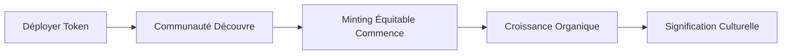

# Guide de workflow visuel

Apprenez le processus de création Bitcoin Stamps grâce à des étapes visuelles claires.

## Processus de création



## Processus étape par étape

### 1. Préparez votre contenu
- **Image** : PNG, JPEG, GIF, SVG, HTML supportés - le coût est la principale contrainte
- **Taille** : Gardez sous 24 Ko pour des frais raisonnables
- **Format** : Optimisez pour le stockage permanent

### 2. Choisissez votre méthode

**Interface Web (Recommandée)**
1. Visitez [stampchain.io/create](https://stampchain.io/tool/stamp/create)
2. Téléchargez votre image
3. Connectez le portefeuille et payez les frais réseau
4. Votre stamp est créé quand votre transaction est confirmée sur Bitcoin

**Intégration SDK**
```typescript
import { TxBuilder } from '@btc-stamps/tx-builder';

const txBuilder = new TxBuilder({ network: 'mainnet' });

const result = await txBuilder.createStamp({
  imageData: imageBuffer,
  fromAddress: 'votre-adresse',
  feeRate: 20
});
```

### 3. Flux de transaction



### 4. Vérifiez votre création
Une fois confirmé sur Bitcoin, votre stamp est :
- ✅ **Permanent** - Stocké pour toujours sur Bitcoin
- ✅ **Vérifiable** - Authentique cryptographiquement
- ✅ **Accessible** - Visible sur les explorateurs de stamps
- ✅ **Transférable** - Peut être transféré à d'autres

## Modèles courants

### Tokens à lancement équitable (comme KEVIN)


## Ressources

- **[Créer votre premier Stamp →](/fr/tutorials/creating-first-stamp)** - Guide de création détaillé
- **[Documentation SDK →](/fr/tutorials/sdk-integration)** - Implémentation technique
- **[Explorateur Stampchain →](https://stampchain.io)** - Voir les stamps existants

---

*Les guides visuels aident à combler le fossé entre la technologie Bitcoin complexe et l'expression créative. Suivez le chemin de KEVIN de la simple création à l'impact culturel durable.*
