# Görsel İş Akışı Rehberi

Net görsel adımlar aracılığıyla Bitcoin Stamps oluşturma sürecini öğrenin.

## Oluşturma Süreci

```mermaid
graph TD
    A[🎨 İçerik Oluştur] --> B[📦 Veri Hazırla]
    B --> C[⚡ İşlem Oluştur]
    C --> D[📡 Bitcoin'e Yayınla]
    D --> E[✅ Kalıcı Stamp Oluşturuldu]

    style A fill:#ff6b6b,stroke:#fff,color:#fff
    style E fill:#4ecdc4,stroke:#fff,color:#fff
```



## Adım Adım Süreç

### 1. İçeriğinizi Hazırlayın
- **Görüntü**: PNG, JPEG, GIF, SVG, HTML desteklenir - maliyet ana kısıtlamadır
- **Boyut**: Makul ücretler için 24KB altında tutun
- **Format**: Kalıcı depolama için optimize edin

### 2. Yönteminizi Seçin

**Web Arayüzü (Önerilen)**
1. [stampchain.io/create](https://stampchain.io/tool/stamp/create) adresini ziyaret edin
2. Görüntünüzü yükleyin
3. Cüzdanı bağlayın ve ağ ücretini ödeyin
4. İşleminiz Bitcoin'de onaylandığında stamp'ınız oluşturulur

**SDK Entegrasyonu**
```typescript
import { TxBuilder } from '@btc-stamps/tx-builder';

const txBuilder = new TxBuilder({ network: 'mainnet' });

const result = await txBuilder.createStamp({
  imageData: imageBuffer,
  fromAddress: 'adresiniz',
  feeRate: 20
});
```

### 3. İşlem Akışı

```mermaid
sequenceDiagram
    participant Siz
    participant TxBuilder
    participant Bitcoin

    Siz->>TxBuilder: Görüntü verisi gönder
    TxBuilder->>TxBuilder: Veriyi optimize et ve kodla
    TxBuilder->>Bitcoin: İşlem oluştur
    Bitcoin->>Bitcoin: Blokta onayla
    Bitcoin-->>Siz: Kalıcı stamp oluşturuldu!
```



### 4. Oluşturmanızı Doğrulayın
Bitcoin'de onaylandıktan sonra stamp'ınız:
- ✅ **Kalıcı** - Bitcoin'de sonsuza kadar saklanır
- ✅ **Doğrulanabilir** - Kriptografik olarak özgün
- ✅ **Erişilebilir** - Stamp gezginlerinde görüntülenebilir
- ✅ **Transfer edilebilir** - Başkalarına devredilebilir

## Yaygın Desenler

### Fair Launch Tokenları (KEVIN gibi)

```mermaid
graph LR
    A[Token Dağıt] --> B[Topluluk Keşfeder]
    B --> C[Adil Mint Başlar]
    C --> D[Organik Büyüme]
    D --> E[Kültürel Önem]
```


### Sanat Koleksiyonları

```mermaid
graph LR
    A[Seri Oluştur] --> B[Yayın Takvimi]
    B --> C[Topluluk Oluşturma]
    C --> D[Koleksiyon Değeri]
```


## Kaynaklar

- **[İlk Stamp'ınızı Oluşturun →](/tr/tutorials/creating-first-stamp)** - Ayrıntılı oluşturma rehberi
- **[SDK Dokümantasyonu →](/tr/tutorials/sdk-integration)** - Teknik uygulama
- **[Stampchain Gezgini →](https://stampchain.io)** - Mevcut stampları görüntüleyin

---

*Görsel rehberler, karmaşık Bitcoin teknolojisi ile yaratıcı ifade arasındaki boşluğu doldurmaya yardımcı olur. KEVIN'in basit yaratımdan kalıcı kültürel etkiye giden yolunu takip edin.*
