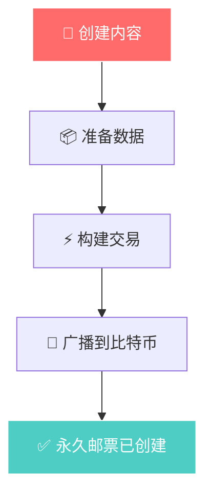
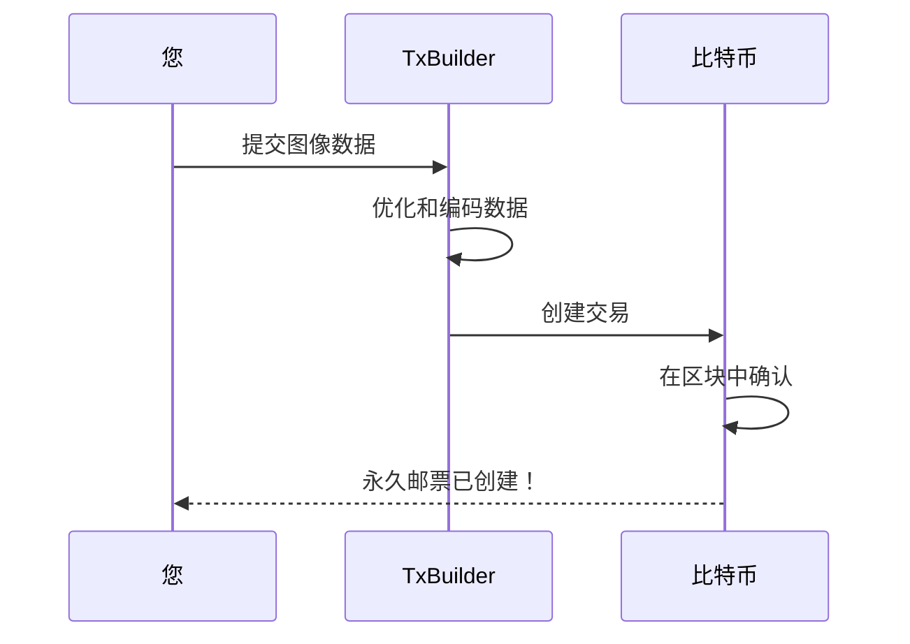
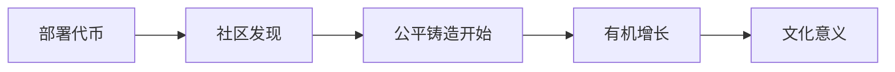
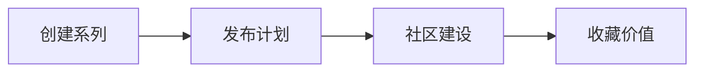

# 可视化工作流程指南

通过清晰的可视化步骤学习 Bitcoin Stamps 创建流程。

## 创建流程



## 分步流程

### 1. 准备您的内容
- **图像**：支持 PNG、JPEG、GIF、SVG、HTML - 成本是主要约束
- **大小**：保持在 24KB 以下以获得合理费用
- **格式**：针对永久存储进行优化

### 2. 选择您的方法

**Web 界面（推荐）**
1. 访问 [stampchain.io/create](https://stampchain.io/tool/stamp/create)
2. 上传您的图片
3. 连接钱包并支付网络费用
4. 当您的交易在比特币上确认时，您的邮票就创建好了

**SDK 集成**
```typescript
import { TxBuilder } from '@btc-stamps/tx-builder';

const txBuilder = new TxBuilder({ network: 'mainnet' });

const result = await txBuilder.createStamp({
  imageData: imageBuffer,
  fromAddress: '您的地址',
  feeRate: 20
});
```

### 3. 交易流程



### 4. 验证您的创建
在比特币上确认后，您的邮票：
- ✅ **永久** - 在比特币上永久存储
- ✅ **可验证** - 密码学上真实
- ✅ **可访问** - 在邮票浏览器上可查看
- ✅ **可转让** - 可以转让给他人

## 常见模式

### 公平发行代币（如 KEVIN）


### 艺术收藏


## 资源

- **[创建您的第一个邮票 →](/zh/tutorials/creating-first-stamp)** - 详细创建指南
- **[SDK 文档 →](/zh/tutorials/sdk-integration)** - 技术实现
- **[Stampchain 浏览器 →](https://stampchain.io)** - 查看现有邮票

---

*可视化指南有助于弥合复杂的比特币技术与创意表达之间的差距。跟随 KEVIN 从简单创作到持久文化影响的道路。*
